# Neo CQI API Design Notes

## Current CQI Capabilities

```text

Current CQI Capabilities
├── Report discovery and filter setup
├── Drug library / care area / drug reference data
├── Compliance analysis
├── Limit-event analysis
├── Dose-rate-change analysis
├── Device usage analysis
├── Infusion story reconstruction
├── Guardian event reporting (limited)
├── Export and audit
├── Pump Event History Log files Collection, Aggregation and Download
└── Data quality / processing observability

```

## Future CQI Capabilities (Short Term)

```text

Future CQI Capabilities (Short Term)
├── Alarms Analysis
├── Minimum Required Flow Rate Analysis
├── Data push to BCLP for Replication
├── PeerVue capabilities in CQI (functionality merge)
├── DoseIQ Integration
├── DeviceVue Integration
├── Usage Analytics
└── New Guardian Report

```

## Future CQI Capabilities (Long Term)

```text

Future CQI Capabilities (Long Term)
├── Predictive Maintianence for the Pumps
├── Reliability Metrics Collection and Aggregation for Pumps
├── AutoDocumentation capabilities
├── Analysis of Pumps Events Data and EHL Data to determine usage patterns
└── Alarm Burden/Fatigue Analytics

```


# Domain Concepts

<table bgcolor="green">
<tr>
<td>💡</td>
<td>
<strong><i>Notes on Domain Driven Design Approach<i></strong><br/><br/>
<i>We have identified domains (core and related ones) and sub-domains (which are
bounded contexts) in which these domains are being viewed/operated upon. Based
on this, the API design will emanate.<i>
</td>
</tr>
</table>


## Current Infusion Therapy Specific Domain Concepts
```text

Customer / Site / Tenant
Distribution Enterprise hierarchy
Device
Drug library
Infusion Care area
Drug
Infusion
Guardian event
Pump Event History Log Event

```

## Current CQI Specific Domain Concepts
```text

Report
Filter
Export
User preference
Data processing status

```
## Future Domain Concepts (Short Term)
```text

Data Replication Config
Data Replication Payload
Comparator Data For PeerVue
Seed Data For PeerVue
Care Area Mapping Data
PeerVue Configurations
Drug Library Feedback
DoseIQ Configurations
DeviceVue Configurations
CQI Usage Details
```

## Future CQI Domain Concepts (Long Term)
```text

TBD if additional Domains are needed

```

---
---

# Domain Driven Design Diagram

The **Infusion Domain** is the core domain of the CQI platform. The surrounding
high-level domains (Customer/Site/Tenant, Device, Drug Library, and Guardian) are
supporting/generic domains that provide context, reference data, and signals the
core Infusion Domain depends on. Each high-level domain is decomposed into its
bounded contexts (subdomains).

```mermaid
flowchart LR
    classDef core fill:#0b5394,stroke:#052a4f,stroke-width:2px,color:#ffffff;
    classDef supporting fill:#e8eef7,stroke:#0b5394,stroke-width:1px,color:#0b2038;
    classDef domainhdr fill:#0b5394,stroke:#052a4f,stroke-width:2px,color:#ffffff;
    classDef supdomainhdr fill:#c9d8ee,stroke:#0b5394,stroke-width:1px,color:#0b2038;
    classDef future_supporting fill:#cfe123,stroke:#0b5394,stroke-width:1px,color:#0b2038;
    classDef future_supdomainhdr fill:#8080ff,stroke:#0b5394,stroke-width:1px,color:#0b2038;

    %% ============ CORE DOMAIN (top) ============
    CORE(["🎯 Infusion Domain "]):::domainhdr

    INF_LIMITS["Limits<br/>(hard, soft limits)"]:::core
    INF_DOSERATES["Dose Rates Changes"]:::core
    INF_COMPLIANCE["DERS Compliance"]:::core
    INF_STORY["Infusion Story"]:::core
    INF_PROG["Programming Mode<br/>(Auto, Manual)"]:::core
    INF_DELIVERY["Delivery Modes<br/>(AOT, VOT, Continuous)"]:::core
    INF_CONC["Concentration Types<br/>(Fixed, Standard,<br/>Variable, mL mode)"]:::core
    INF_BAG["Delivery Bag Configuration"]:::core
    INF_BOLUS["Bolus Dose Configuration"]:::core
    INF_LOADING["Loading Dose Configuration"]:::core
    INF_FLUSH["Line Flush Dose Configuration"]:::core
    INF_KVO["KVO Dose Configuration"]:::core
    INF_ALARMS["Alarms"]:::core

    CORE --- INF_LIMITS 
    CORE --- INF_DOSERATES
    CORE --- INF_COMPLIANCE 
    CORE --- INF_STORY 
    CORE --- INF_PROG
    CORE --- INF_DELIVERY 
    CORE --- INF_BAG 
    CORE --- INF_BOLUS 
    CORE --- INF_LOADING
    CORE --- INF_FLUSH 
    CORE --- INF_KVO 
    CORE --- INF_ALARMS
    INF_DELIVERY --- INF_CONC

    %% ============ SUPPORTING DOMAINS (feed into core) ============
    CUST(["Customer / Site / Tenant Domain"]):::supdomainhdr
    CUST_DETAILS["Customer Details"]:::supporting
    CUST_ENTITLE["Entitlements"]:::supporting
    
    CUST --- CUST_DETAILS 
    CUST --- CUST_ENTITLE

    DEV(["Device Domain"]):::supdomainhdr
    DEV_HIER["Distribution Enterprise Hierarchy"]:::supporting
    DEV_UTIL["Device Utilization"]:::supporting
    DEV_ASSOC["Device Association<br/>(location, demographics)"]:::supporting
    DEV_LOGS["Device Logs (EHL)"]:::supporting
    DEV_NET["Device Network Connectivity"]:::supporting
    DEV_SW["Device Software Configuration"]:::supporting
    DEV_TYPE["Device Type / Model"]:::supporting
    
    DEV --- DEV_HIER 
    DEV --- DEV_UTIL 
    DEV --- DEV_ASSOC 
    DEV --- DEV_LOGS
    DEV --- DEV_NET 
    DEV --- DEV_SW 
    DEV --- DEV_TYPE

    DRUG(["Drug Library Domain"]):::supdomainhdr
    DL_DRUG["Drug"]:::supporting
    DL_CAREAREA["Care Area"]:::supporting
    DL_VERSIONS["Drug Library Versions"]:::supporting
    DL_MODIFIERS["Drug Modifiers"]:::supporting
    
    DRUG --- DL_DRUG 
    DRUG --- DL_CAREAREA 
    DRUG --- DL_VERSIONS 
    DRUG --- DL_MODIFIERS

    GRD(["Guardian Domain"]):::supdomainhdr
    GRD_EVENTS["Guardian Events"]:::supporting
    GRD --- GRD_EVENTS

    %% ============ FUTURE SUPPORTING DOMAINS (feed into core) ============
    CDR(["Data Replication Domain"]):::future_supdomainhdr
    CDR_CONFIGS["Data Replication Configs"]:::future_supporting
    CDR_PAYLOAD["Data Replication Paylod"]:::future_supporting
    
    CDR --- CDR_CONFIGS 
    CDR --- CDR_PAYLOAD

    PV_CONFIGS(["PeerVue Configs"]):::future_supdomainhdr
    PV_SEED_DATA["PeerVue Seed Data Payload"]:::future_supporting
    PV_OWN_DATA["PeerVue Own Data Paylod"]:::future_supporting
    
    PV_CONFIGS --- PV_SEED_DATA 
    PV_CONFIGS --- PV_OWN_DATA

    DIQ_CONFIGS(["DoseIQ Configs"]):::future_supdomainhdr
    DL_FB["Drug Library Feedback/Insights"]:::future_supporting
    
    DIQ_CONFIGS --- DL_FB 

    DV_CONFIGS(["DeviceVue Configs"]):::future_supdomainhdr
    DV_DEVICE_INFO["Device Information"]:::future_supporting
    
    DV_CONFIGS --- DV_DEVICE_INFO

    CQI_UA(["CQI Usage Analytics"]):::future_supdomainhdr
    CQI_UA_DATA["Usage Analytics Insights"]:::future_supporting
    
    CQI_UA --- CQI_UA_DATA 

     
```



---
---


<table bgcolor="red">
<tr>
<td>&#128458;</td>
<td>
<strong><i>@subyann, @kbm-bax and @Copilot we have to review/rewrite section from here again to retrofit our comments so far.<i>
</td>
</tr>
</table>


# Bounded Contexts

## For Current CQI

| Bounded Context | Owns | Why it should be separate |
| --- | --- | --- |
| Reference Data Context | Drug library, drug library version, care area, drug, pump type, device metadata, enterprise hierarchy | These are filters and dimensions used across many reports. Recent Neo-CQI work added drug library, care area, and drug details through ingestion, bronze-to-gold movement, and CQIQUERY API updates. |
| Infusion Journey Context | Infusion, infusion lifecycle, infusion story, event sequence | Infusion story is a user-facing CQI concept already present in the current CQI API/UI design. | 
| Compliance Reporting Context | Compliance summaries, compliance infusions, compliance details | Compliance report is an explicit CQI report area in current UI/API documentation. |
| Limit & Alert Context | Soft limit, hard limit, limit type, limit event, Guardian event, alert summary | Internal sources mention Guardian integration, limit-event leaderboard/report requirements, and Guardian events as part of CQI reporting. | 
| Dose Rate Change Context | Dose rate changes, dose change details, dose rate change report filters | Existing API signatures include dose rate change care area and dose rate change infusion detail operations. | 
| Device Usage Context | Device activity, utilization, pump availability, device usage report | CQI v3.3 requirements include Device Usage Report filters by drug library, device type, and enterprise group, plus reset and retained selections. |
| Report Experience Context | Saved filters, preferences, report state, export requests | Current CQI UI documentation includes user preference APIs, saved filters, sorting, paging, and export-oriented workflows. |
| Data Operations Context | Processing status, data quality, late messages, duplicates, invalid messages, lineage | CQI FMEA and known failure-mode notes call out schema drift, retry, observability, rollback, duplicate handling, dead-letter/invalid messages, and out-of-order message risks. |


## For Future CQI (Short Term)
| Bounded Context | Owns | Why it should be separate |
| --- | --- | --- |
| TBD | TBD | TBD |


## For Future CQI (Long Term)
| Bounded Context | Owns | Why it should be separate |
| --- | --- | --- |
| TBD | TBD | TBD |

# Recommended API Structure

## Suggested Implementetion Plan

```text

        Pump / IQE / Guardian events
                    ↓
            Raw event ingestion
                    ↓
        Canonical event validation
                    ↓
        Domain event normalization
                    ↓
           Lakehouse storage
                    ↓
CQI semantic projections / materialized views
                    ↓
           Domain query services
                    ↓
           Neo CQI API contracts
                    ↓
                 CQI UI

```

## For Current CQI
* [reference-data-api](neo-cqi-api-contracts/cqi-reference-data-api.yaml)
* [compliance-api](neo-cqi-api-contracts/cqi-compliance-api.yaml)
* [limits-api](neo-cqi-api-contracts/cqi-limits-api.yaml)
* [dose-rate-change-api](neo-cqi-api-contracts/cqi-dose-rate-changes-api.yaml)
* [device-usage-api](neo-cqi-api-contracts/cqi-device-usage-api.yaml)
* [infusion-story-api](neo-cqi-api-contracts/cqi-infusion-story-api.yaml)
* [guardian-alert-api](neo-cqi-api-contracts/cqi-guardian-alert-api.yaml)
* [report-preferences-api](neo-cqi-api-contracts/cqi-report-preferences-api.yaml)
* [data-quality-api](neo-cqi-api-contracts/cqi-data-quality-api.yaml)

## For Future CQI (Short Term)
TBD

## For Future CQI (Long Term)
TBD

## API Detailed Design Notes

### reference-data-api

#### Responsibilities
##### Owns:
```text
Drug Library
Drug Library Version
Care Area
Drug
Device Metadata
Enterprise Hierarchy
Location
Report Filter Metadata
```
##### Does NOT own:
```text
Infusions
Guardian Events
Reports
Compliance Calculations
```

#### Domain Model
```text
DrugLibrary
 └─ DrugLibraryVersion
      ├─ CareArea
      ├─ Drug
      └─ PumpType

EnterpriseHierarchy
 └─ EnterpriseGroup
      └─ Hospital
           └─ Location

Device
 ├─ Serial Number
 ├─ Pump Type
 └─ Current Metadata
```

#### Events Owned by Reference Data Context
Since Neo CQI is event-driven, this context should also publish domain events:

```text
DrugLibraryCreated
DrugLibraryVersionActivated
CareAreaAdded
CareAreaUpdated
DrugAdded
DrugUpdated
EnterpriseHierarchyChanged
DeviceRegistered
DeviceMetadataUpdated
```

#### Final Reference Data Context API Portfolio
```text
GET /reference/filter-model

GET /reference/drug-libraries
GET /reference/drug-libraries/{id}
GET /reference/drug-libraries/{id}/versions

GET /reference/drug-library-versions/{id}/care-areas

GET /reference/care-areas/{id}

GET /reference/drugs
GET /reference/drugs/{id}

GET /reference/enterprise-hierarchy
GET /reference/enterprise-hierarchy/{id}/children

GET /reference/devices
GET /reference/devices/{id}

GET /reference/report-filters
```

This would be the first bounded context implemented, because every other context (Compliance, Limits, Guardian, Infusion Story, Device Usage) depends on it but it has almost no dependency on them. It is the cleanest place to establish ubiquitous language and API governance before the report-centric APIs are designed.


---
---

### compliance-api
#### Responsibilities
##### Owns:
```text
Compliance Evaluation
Compliance Status
Compliance Summary
Compliance Breakdown
Non-Compliant Infusions
Compliance Trends
Compliance Metrics
```
##### Does NOT own:

```text
Reference Data Context
Infusion Journey Context
Limit & Alert Context
Guardian Context
Device Usage Context
Report Experience Context
Export Context
Data Operations / Data Quality Context
Lakehouse / Storage Context
```

##### Consumes:

###### From Reference Context:

```text
DrugLibrary
DrugLibraryVersion
CareArea
Drug
Enterprise Hierarchy

```

###### From Reference Context:

```text
Infusion

```

#### Domain Model
```text

Core Model

ComplianceEvaluation
 ├─ infusionId
 ├─ complianceStatus
 ├─ evaluatedAt
 ├─ evaluatedAgainst
 │   ├─ drugLibraryVersionId
 │   ├─ careAreaId
 │   ├─ drugId
 │   └─ complianceDefinitionVersion
 └─ findings[]
      ├─ findingCode
      ├─ severity
      ├─ description
      ├─ occurredAt
      └─ relatedEventReference
```

```text
Analytical Model

ComplianceSummary
 ├─ totalInfusions
 ├─ compliantInfusions
 ├─ nonCompliantInfusions
 ├─ unknownComplianceInfusions
 └─ complianceRate

ComplianceBreakdown
 ├─ groupBy
 └─ items[]
      ├─ id
      ├─ name
      ├─ totalInfusions
      ├─ compliantInfusions
      ├─ nonCompliantInfusions
      ├─ unknownComplianceInfusions
      └─ complianceRate

ComplianceTrend
 ├─ granularity
 └─ points[]
      ├─ periodStart
      ├─ periodEnd
      ├─ totalInfusions
      ├─ compliantInfusions
      ├─ nonCompliantInfusions
      └─ complianceRate

```
```text
Infusion compliance view

ComplianceInfusion
 ├─ infusionId
 ├─ deviceId
 ├─ deviceSerialNumber
 ├─ pumpType
 ├─ drugLibraryVersionId
 ├─ careAreaId
 ├─ careAreaName
 ├─ drugId
 ├─ drugName
 ├─ complianceStatus
 ├─ startedAt
 └─ endedAt

```

#### Events Owned by Reference Data Context
Since Neo CQI is event-driven, this context should also publish domain events:

```text
ComplianceEvaluationCreated
ComplianceEvaluationUpdated
ComplianceSummaryCalculated
ComplianceBreakdownCalculated
ComplianceTrendCalculated
NonCompliantInfusionDetected
ComplianceFindingCreated
ComplianceFindingResolved
ComplianceDefinitionChanged
ComplianceDataRefreshed
```

#### Final Reference Data Context API Portfolio
```text
POST /api/cqi/v1/compliance/summary-query
POST /api/cqi/v1/compliance/breakdown-query
POST /api/cqi/v1/compliance/trends-query
POST /api/cqi/v1/compliance/infusions-query

GET  /api/cqi/v1/compliance/infusions/{infusionId}
GET  /api/cqi/v1/compliance/infusions/{infusionId}/evaluation

POST /api/cqi/v1/compliance/exports
GET  /api/cqi/v1/compliance/exports/{exportId}
```

This would be the first bounded context implemented, because every other context (Compliance, Limits, Guardian, Infusion Story, Device Usage) depends on it but it has almost no dependency on them. It is the cleanest place to establish ubiquitous language and API governance before the report-centric APIs are designed.

---
---

### limits-api
#### Responsibilities
##### Owns:

```text

Infusion Limit Event
Soft Limit Event
Hard Limit Event
Spectrum Indirect Limit Event
Limit Event Summary
Limit Event Breakdown
Limit Event Trend
Limit Event Detail
Limit Next Action
Limit Outcome
Limit Parameter Distribution
Limit Event Leaderboard
Limit Event Export View

```


##### Does NOT own:

```text

Reference Data Context
Infusion Journey Context
Compliance Context
Guardian Context
Device Usage Context
Report Experience Context
Export Context
Data Operations / Data Quality Context
Lakehouse / Storage Context

```

##### Consumes
###### from Reference Data Context:

```text

DrugLibraryVersion
CareArea
Drug
PumpType
Device
EnterpriseHierarchyNode

```


###### from Infusion Journey Context:

```text
Infusion
InfusionEvent
ProgrammingEvent
InfusionStart/End facts
Pump run value
Infusion story availability indicator

```

###### from Guardian / Alert Context:

```text
GuardianEventDetected
GuardianAlertReference
GuardianLimitSignal

```

###### from Data Operations / Data Quality Context:

```text
DataFreshness
Watermark
DataQualityIndicator
ProcessingStatus


```

##### Domain Model

```text
Core model
LimitEvent
 ├─ limitEventId
 ├─ infusionId
 ├─ eventType
 │   ├─ SOFT_LIMIT
 │   ├─ HARD_LIMIT
 │   ├─ SPECTRUM_INDIRECT_LIMIT
 │   └─ GUARDIAN_LIMIT
 ├─ limitDirection
 │   ├─ UPPER
 │   ├─ LOWER
 │   └─ UNKNOWN
 ├─ limitParameter
 │   ├─ DOSE
 │   ├─ RATE
 │   ├─ VOLUME
 │   ├─ TIME
 │   ├─ CONCENTRATION
 │   ├─ DRUG_AMOUNT
 │   └─ PATIENT_WEIGHT
 ├─ attemptedValue
 ├─ limitValue
 ├─ finalPumpRunValue
 ├─ nextAction
 ├─ occurredAt
 ├─ drugLibraryVersionId
 ├─ careAreaId
 ├─ drugId
 ├─ deviceId
 └─ sourceEventReference


```

```text

Analytical model

LimitSummary
 ├─ totalLimitEvents
 ├─ softLimitEvents
 ├─ hardLimitEvents
 ├─ spectrumIndirectLimitEvents
 ├─ guardianLimitEvents
 ├─ overrideCount
 ├─ pullbackCount
 ├─ drugChangeCount
 ├─ basicModeCount
 └─ cancelledCount

LimitBreakdown
 ├─ groupBy
 └─ items[]
      ├─ id
      ├─ name
      ├─ totalLimitEvents
      ├─ softLimitEvents
      ├─ hardLimitEvents
      ├─ overrideCount
      ├─ pullbackCount
      └─ eventRate

LimitTrend
 ├─ granularity
 └─ points[]
      ├─ periodStart
      ├─ periodEnd
      ├─ totalLimitEvents
      ├─ softLimitEvents
      ├─ hardLimitEvents
      └─ overrideCount

```

```text
Detail model
LimitEventDetail
 ├─ limitEventId
 ├─ infusionId
 ├─ eventType
 ├─ limitParameter
 ├─ limitDirection
 ├─ attemptedValue
 ├─ limitValue
 ├─ finalPumpRunValue
 ├─ nextAction
 ├─ drug
 ├─ careArea
 ├─ drugLibraryVersion
 ├─ device
 ├─ occurredAt
 ├─ canShowInfusionStory
 └─ infusionStoryAvailabilityReason


```

##### Events Owned by this API

```text

LimitEventRecorded
SoftLimitEventRecorded
HardLimitEventRecorded
SpectrumIndirectLimitEventRecorded
GuardianLimitEventReferenced
LimitNextActionClassified
LimitSummaryCalculated
LimitBreakdownCalculated
LimitTrendCalculated
LimitParameterDistributionCalculated
LimitEventExportRequested
LimitDataRefreshed


```

##### Final API Portfolio

```text

POST /api/cqi/v1/limits/summary-query
POST /api/cqi/v1/limits/breakdown-query
POST /api/cqi/v1/limits/trends-query
POST /api/cqi/v1/limits/events-query
GET  /api/cqi/v1/limits/events/{limitEventId}
GET  /api/cqi/v1/limits/events/{limitEventId}/infusion-story-reference
POST /api/cqi/v1/limits/parameter-distribution-query
POST /api/cqi/v1/limits/exports
GET  /api/cqi/v1/limits/exports/{exportId}

```


### dose-rate-change-api
#### Responsibilities
##### Owns:

```text
Infusion Dose Rate Change
Dose Rate Change Summary
Dose Rate Change Breakdown
Dose Rate Change Trend
Dose Rate Change Detail
Dose Rate Change Average Metrics
Dose Rate Change Direction
Dose Rate Change Outcome
Dose Rate Change Frequency
Dose Rate Change Event Chart
Dose Rate Change Export View

```


##### Does NOT own:

```text

Reference Data Context
Infusion Journey Context
Limits Context
Compliance Context
Guardian Context
Device Usage Context
Report Experience Context
Export Context
Data Operations / Data Quality Context
Lakehouse / Storage Context

```

##### Consumes
###### from Reference Data Context:

```text

DrugLibraryVersion
CareArea
Drug
PumpType
Device
EnterpriseHierarchyNode

```


###### from Infusion Journey Context:

```text

Infusion
InfusionEvent
ProgrammingEvent
DoseRateChangeFact
InfusionStarted
InfusionCompleted
PumpRunValue

```

###### from Limits Context:

```text

LimitEventReference
DoseRateChangeLimitOutcome
Pullback
Override
WithinLimit

```

###### from Pump/Event Normalization Context:

```text

PumpEventReceived
DoseRatePriorValue
DoseRateResultingValue
DoseRateUnits
ProgramType
ModeType
SourceEventReference


```
###### from Data Operations / Data Quality Context:

```text

DataFreshness
Watermark
DataQualityIndicator
ProcessingStatus


```
##### Domain Model

```text

Core model

DoseRateChangeEvent
 ├─ doseRateChangeEventId
 ├─ infusionId
 ├─ occurredAt
 ├─ direction
 │   ├─ INCREASE
 │   ├─ DECREASE
 │   └─ UNKNOWN
 ├─ priorDoseRate
 ├─ attemptedDoseRate
 ├─ resultingDoseRate
 ├─ completedDoseRate
 ├─ doseRateUnits
 ├─ changeAmount
 ├─ changePercent
 ├─ outcome
 │   ├─ WITHIN_LIMIT
 │   ├─ LIMIT_EVENT
 │   ├─ PULLBACK
 │   ├─ OVERRIDE
 │   ├─ CANCELLED
 │   └─ UNKNOWN
 ├─ drugLibraryVersionId
 ├─ careAreaId
 ├─ drugId
 ├─ deviceId
 ├─ pumpType
 ├─ programType
 ├─ modeType
 └─ sourceEventReference
`


```

```text

Analytical model

DoseRateChangeSummary
 ├─ totalDoseRateChanges
 ├─ increaseCount
 ├─ decreaseCount
 ├─ withinLimitCount
 ├─ limitEventCount
 ├─ pullbackCount
 ├─ overrideCount
 ├─ averageIncreaseAttemptedPullback
 ├─ averageDecreaseAttemptedPullback
 ├─ averageIncreaseAttemptedOverride
 ├─ averageDecreaseAttemptedOverride
 ├─ averageIncreaseCompletedWithinLimit
 └─ averageDecreaseCompletedWithinLimit

```

```text

Breakdown Model
DoseRateChangeBreakdown
 ├─ groupBy
 └─ items[]
      ├─ id
      ├─ name
      ├─ totalDoseRateChanges
      ├─ increaseCount
      ├─ decreaseCount
      ├─ withinLimitCount
      ├─ limitEventCount
      ├─ pullbackCount
      └─ overrideCount

```

```text

Detail model
DoseRateChangeDetail
 ├─ doseRateChangeEventId
 ├─ infusionId
 ├─ occurredAt
 ├─ drugName
 ├─ drugModifier
 ├─ concentration
 ├─ careAreaName
 ├─ deviceSerialNumber
 ├─ pumpType
 ├─ priorDoseRate
 ├─ attemptedDoseRate
 ├─ resultingDoseRate
 ├─ completedDoseRate
 ├─ outcome
 ├─ relatedLimitEventId
 └─ sourceEventReference


```

##### Events Owned by this API

```text

DoseRateChangeEventRecorded
DoseRateChangeOutcomeClassified
DoseRateChangeSummaryCalculated
DoseRateChangeBreakdownCalculated
DoseRateChangeTrendCalculated
DoseRateChangeAverageMetricsCalculated
DoseRateChangeExportRequested
DoseRateChangeDataRefreshed


```

##### Final API Portfolio

```text

POST /api/cqi/v1/dose-rate-changes/summary-query
POST /api/cqi/v1/dose-rate-changes/breakdown-query
POST /api/cqi/v1/dose-rate-changes/trends-query
POST /api/cqi/v1/dose-rate-changes/average-metrics-query
POST /api/cqi/v1/dose-rate-changes/events-query
GET  /api/cqi/v1/dose-rate-changes/events/{doseRateChangeEventId}
POST /api/cqi/v1/dose-rate-changes/exports
GET  /api/cqi/v1/dose-rate-changes/exports/{exportId}


```


### device-usage-api

#### Responsibilities
##### Owns:

```text
Device Usage Summary
Device Utilization
Device Activity
Device Connectivity
Device Usage Trend
Device Usage Detail
Device Alarm / Error Summary
Device Alarm / Error Detail
Device Usage Graph Data
Device Usage Export View


```


##### Does NOT own:

```text

Reference Data Context
Infusion Journey Context
Limits Context
Compliance Context
Guardian Context
Report Experience Context
Export Context
Data Operations / Data Quality Context
Lakehouse / Storage Context
Device Management Context

```

##### Consumes
###### from Reference Data Context:

```text

Device
PumpType
DrugLibrary
DrugLibraryVersion
EnterpriseHierarchyNode
CareArea
Drug

```


###### from Infusion Journey Context:

```text

Infusion
InfusionStarted
InfusionCompleted
InfusionEventRecorded
InfusionCount
InfusionStoryReference

```

###### from  Device Management / IQE source systems Context:

```text

Device registration metadata
Device model/type metadata
Current or last-known enterprise group

```

###### from Pump/Event Normalization Context:

```text

DeviceConnected
DeviceDisconnected
ConnectivityEvent
DeviceActivityEvent
PumpErrorEvent
AlarmEvent
DeviceStatusChanged


```
###### from Data Operations / Data Quality Context:

```text

DataFreshness
Watermark
ProcessingStatus
DataQualityIndicator


```
##### Domain Model

```text

Core model

DeviceUsageSummary
 ├─ deviceId
 ├─ deviceSerialNumber
 ├─ pumpType
 ├─ deviceModel
 ├─ deviceStatus
 ├─ connectionPercentage
 ├─ averageUtilization
 ├─ currentEnterpriseHierarchyNodeId
 ├─ currentEnterpriseGroupName
 ├─ infusionCount
 ├─ errorCount
 └─ lastUpdatedAt


```

```text

Utilization model
DeviceUtilization
 ├─ deviceId
 ├─ deviceSerialNumber
 ├─ utilizationPercentage
 ├─ connectedDuration
 ├─ activeInfusionDuration
 ├─ idleDuration
 ├─ unavailableDuration
 └─ period


```

```text

Activity Model
DeviceActivity
 ├─ deviceId
 ├─ deviceSerialNumber
 ├─ activityCount
 ├─ infusionCount
 ├─ connectCount
 ├─ disconnectCount
 ├─ errorCount
 ├─ alarmCount
 └─ period

```

```text

Alarm model

DeviceUsageErrorEvent
 ├─ deviceUsageErrorEventId
 ├─ deviceId
 ├─ deviceSerialNumber
 ├─ infusionId
 ├─ occurredAt
 ├─ errorName
 ├─ alarmName
 ├─ drugName
 ├─ drugModifier
 ├─ concentration
 ├─ doseRate
 ├─ careAreaId
 ├─ careAreaName
 ├─ enterpriseHierarchyNodeId
 ├─ enterpriseGroupName
 └─ sourceEventReference


```

```text

Trend model

DeviceUsageTrend
 ├─ granularity
 └─ points[]
      ├─ periodStart
      ├─ periodEnd
      ├─ deviceCount
      ├─ averageConnectionPercentage
      ├─ averageUtilization
      ├─ infusionCount
      ├─ errorCount
      └─ alarmCount


```

##### Events Owned by this API

```text
DeviceUsageSummaryCalculated
DeviceUtilizationCalculated
DeviceActivityCalculated
DeviceUsageTrendCalculated
DeviceUsageErrorEventRecorded
DeviceUsageExportRequested
DeviceUsageDataRefreshed


```

##### Final API Portfolio

```text

POST /api/cqi/v1/device-usage/summary-query
POST /api/cqi/v1/device-usage/utilization-query
POST /api/cqi/v1/device-usage/activity-query
POST /api/cqi/v1/device-usage/trends-query
POST /api/cqi/v1/device-usage/errors-query
GET  /api/cqi/v1/device-usage/errors/{deviceUsageErrorEventId}
GET  /api/cqi/v1/device-usage/devices/{deviceId}
POST /api/cqi/v1/device-usage/exports
GET  /api/cqi/v1/device-usage/exports/{exportId}


```


### infusion-story-api

#### Responsibilities
##### Owns:

```text
Infusion Story
Infusion Story Header
Infusion Story Graph
Infusion Story Timeline
Infusion Story Event Sequence
Infusion Story Delivery Status
Infusion Story Plot Points
Infusion Story Event Icons
Infusion Story Alert Icons
Infusion Story Tooltip Data
Infusion Navigation Reference
Infusion Story Availability


```


##### Does NOT own:

```text

Reference Data Context
Compliance Context
Limits Context
Device Usage Context
Guardian Context
Report Experience Context
Export Context
Data Operations / Data Quality Context
Lakehouse / Storage Context
Raw Pump Event Ingestion Context

```

##### Consumes
###### from Reference Data Context:

```text
Device
PumpType
Drug
DrugLibraryVersion
CareArea
EnterpriseHierarchyNode
``


```


###### from Infusion Journey Context:

```text

Infusion
InfusionStarted
InfusionCompleted
InfusionEventRecorded
DeliveryStatusChanged
FlowRateChanged
DoseRateChanged
VolumeInfusedUpdated
InitialProgramRecorded


```

###### from Limits Context:

```text

LimitEventRecorded
SoftLimitEventRecorded
HardLimitEventRecorded
LimitNextActionClassified

```

###### from Guardian Context:

```text

GuardianEventDetected
GuardianAdvisoryReference
GuardianTooltipData


```
###### from Device Usage / Pump Events:

```text

PumpRunStarted
PumpRunStopped
DevicePowerEvent
AlarmEvent
StatusEvent


```
##### Domain Model

```text

Core model

InfusionStory
 ├─ infusionId
 ├─ header
 ├─ graph
 ├─ events[]
 ├─ alerts[]
 ├─ navigation
 └─ dataFreshness


```

```text

Header model

InfusionStoryHeader
 ├─ infusionId
 ├─ infusionNumber
 ├─ deviceSerialNumber
 ├─ deviceModel
 ├─ pumpType
 ├─ infusionStartDateTime
 ├─ infusionEndDateTime
 ├─ careAreaId
 ├─ careAreaName
 ├─ drugId
 ├─ drugName
 ├─ drugModifier
 ├─ drugAlias
 ├─ concentration
 ├─ startingDoseRate
 ├─ startingFlowRate
 ├─ programType
 ├─ enterpriseHierarchyNodeId
 ├─ enterpriseGroupName
 ├─ totalInfusionTime
 └─ totalVolumeInfused

```

```text

Graph Model

InfusionStoryGraph
 ├─ deliveryStatusSegments[]
 ├─ flowRateSeries[]
 ├─ doseRateSeries[]
 ├─ totalVolumeSeries[]
 ├─ eventMarkers[]
 ├─ alertMarkers[]
 └─ tooltipDefinitions[]

```

```text

Event model

InfusionStoryEvent
 ├─ eventId
 ├─ eventType
 ├─ eventCategory
 ├─ occurredAt
 ├─ label
 ├─ flowRate
 ├─ doseRate
 ├─ totalVolume
 ├─ vtbi
 ├─ deliveryStatus
 ├─ sourceEventReference
 └─ tooltip

```

```text

Alert / limit / Guardian marker model

InfusionStoryMarker
 ├─ markerId
 ├─ markerType
 │   ├─ LIMIT
 │   ├─ GUARDIAN
 │   ├─ ALARM
 │   ├─ DEVICE_STATUS
 │   └─ USER_ACTION
 ├─ occurredAt
 ├─ label
 ├─ severity
 ├─ relatedEventId
 ├─ relatedReportContext
 └─ tooltip


```


```text

Navigation Model

InfusionStoryNavigation
 ├─ previousInfusionId
 ├─ nextInfusionId
 ├─ previousDrugId
 └─ nextDrugId


```
##### Events Owned by this API

```text
InfusionStoryBuilt
InfusionStoryUpdated
InfusionStoryGraphBuilt
InfusionStoryHeaderBuilt
InfusionStoryTimelineBuilt
InfusionStoryMarkerAdded
InfusionStoryNavigationResolved
InfusionStoryDataRefreshed


```

##### Final API Portfolio

```text

GET  /api/cqi/v1/infusion-stories/{infusionId}
GET  /api/cqi/v1/infusion-stories/{infusionId}/header
GET  /api/cqi/v1/infusion-stories/{infusionId}/graph
GET  /api/cqi/v1/infusion-stories/{infusionId}/events
GET  /api/cqi/v1/infusion-stories/{infusionId}/markers
GET  /api/cqi/v1/infusion-stories/{infusionId}/navigation
POST /api/cqi/v1/infusion-stories/availability-query
POST /api/cqi/v1/infusion-stories/exports
GET  /api/cqi/v1/infusion-stories/exports/{exportId}


```


### guardian-alert-api

#### Responsibilities
##### Owns:

```text

Guardian Alert
Guardian Advisory Event
Guardian Alert Summary
Guardian Alert Breakdown
Guardian Alert Trend
Guardian Alert Detail
Guardian Alert Tooltip View
Guardian Alert Feedback View
Guardian Alert Insight View
Guardian Alert Export View
Guardian Alert Infusion Story Reference

```


##### Does NOT own:

```text

Guardian Model / Algorithm Context
Guardian Configuration Context
Reference Data Context
Infusion Story Context
Limits Context
Compliance Context
Device Usage Context
Report Experience Context
Export Context
Data Operations / Data Quality Context
Lakehouse / Storage Context
Raw Pump Event Ingestion Context
Pump Runtime / Pump Operation Context

```

##### Consumes

###### from Guardian Processing / Applicaiton Context:

```text

GuardianAlertGenerated
GuardianAdvisoryEvent
GuardianModelVersion
GuardianConfigurationVersion
GuardianThresholdViolated
GuardianAlertCode
GuardianAlertValue
GuardianAttemptedValue


```

###### from Reference Data Context:

```text

DrugLibraryVersion
CareArea
Drug
DrugAlias
Device
PumpType
EnterpriseHierarchyNode

```


###### from Infusion Story Context:

```text

InfusionStoryReference
Infusion Timeline Position
InfusionId


```

###### from Limits / Dose Rate Change Contexts:

```text
LimitEventReference
RateChangeAttemptedValue
DoseRatePrior
LimitExceededValue
NextAction


```

###### from  User Feedback / CQI Feedback Flow Context:

```text

GuardianFeedbackSubmitted
UsefulFeedback
NotUsefulFeedback
ClinicalRelevanceFeedback


```
###### from Data Operations / Data Quality Context:

```text
DataFreshness
Watermark
ProcessingStatus
DataQualityIndicator

```
##### Domain Model

```text

Core model

GuardianAlert
 ├─ guardianAlertId
 ├─ infusionId
 ├─ alertCode
 ├─ advisoryEvent
 ├─ alertCategory
 ├─ alertValue
 ├─ attemptedValue
 ├─ thresholdViolated
 ├─ context
 ├─ occurredAt
 ├─ modelVersion
 ├─ configurationVersion
 ├─ drugLibraryVersionId
 ├─ careAreaId
 ├─ drugId
 ├─ deviceId
 ├─ pumpType
 ├─ relatedLimitEventId
 ├─ relatedDoseRateChangeEventId
 ├─ infusionStoryReference
 └─ sourceEventReference


```

```text

Tooltip  model
GuardianAlertTooltip
 ├─ guardianAlertId
 ├─ timestamp
 ├─ advisoryEvent
 ├─ alertValue
 ├─ attemptedValue
 ├─ thresholdViolated
 ├─ nextAction
 └─ contextFields[]


```

```text

Analytical model
GuardianAlertSummary
 ├─ totalGuardianAlerts
 ├─ uncommonDrugAlertCount
 ├─ stepRateAlertCount
 ├─ vtbiAlertCount
 ├─ alertsWithFeedbackCount
 ├─ usefulFeedbackCount
 ├─ notUsefulFeedbackCount
 └─ alertsLinkedToInfusionStoryCount


```

```text

Breakdown Model
GuardianAlertBreakdown
 ├─ groupBy
 └─ items[]
      ├─ id
      ├─ name
      ├─ totalGuardianAlerts
      ├─ usefulFeedbackCount
      ├─ notUsefulFeedbackCount
      └─ alertRate

```

```text

Trend model

GuardianAlertTrend
 ├─ granularity
 └─ points[]
      ├─ periodStart
      ├─ periodEnd
      ├─ totalGuardianAlerts
      ├─ uncommonDrugAlertCount
      ├─ stepRateAlertCount
      └─ feedbackCount


```

```text

Feedback model

GuardianAlertFeedback
 ├─ guardianAlertId
 ├─ feedbackValue
 │   ├─ USEFUL
 │   ├─ NOT_USEFUL
 │   └─ UNKNOWN
 ├─ feedbackReason
 ├─ feedbackNote
 ├─ submittedAt
 └─ submittedByUserId

```

##### Events Owned by this API

```text

GuardianAlertProjected
GuardianAlertSummaryCalculated
GuardianAlertBreakdownCalculated
GuardianAlertTrendCalculated
GuardianAlertTooltipBuilt
GuardianAlertFeedbackRecorded
GuardianAlertInfusionStoryLinked
GuardianAlertExportRequested
GuardianAlertDataRefreshed

```

##### Final API Portfolio

```text

POST /api/cqi/v1/guardian-alerts/summary-query
POST /api/cqi/v1/guardian-alerts/breakdown-query
POST /api/cqi/v1/guardian-alerts/trends-query
POST /api/cqi/v1/guardian-alerts/alerts-query
GET  /api/cqi/v1/guardian-alerts/alerts/{guardianAlertId}
GET  /api/cqi/v1/guardian-alerts/alerts/{guardianAlertId}/tooltip
GET  /api/cqi/v1/guardian-alerts/alerts/{guardianAlertId}/infusion-story-reference
POST /api/cqi/v1/guardian-alerts/feedback
POST /api/cqi/v1/guardian-alerts/insights-query
POST /api/cqi/v1/guardian-alerts/exports
GET  /api/cqi/v1/guardian-alerts/exports/{exportId}


```


### report-preferences-api

#### Responsibilities
##### Owns:

```text

Report Preference
Saved Filter
Default Filter Selection
Report-Specific Filter State
Report View Preference
Report Sort Preference
Report Column Preference
Report Pagination Preference
Report Display Preference
Last Used Report Preference
Preference Scope
Preference Ownership

```


##### Does NOT own:

```text

Reference Data Context
Compliance Context
Limits Context
Dose Rate Change Context
Device Usage Context
Guardian Alert Context
Infusion Story Context
Export Context
Authentication / Authorization Context
Data Operations / Data Quality Context
Lakehouse / Storage Context

```

##### Consumes

###### from R Authentication / User Context:

```text

User identity
User ID
Tenant / site context
Role / permission context

```


###### from Reference Data Context:

```text
Report type
Supported filter definitions
Supported sort fields
Supported columns
Supported display modes


```


###### from Device Usage Report behavior:

```text

Report-specific advanced filter selection
Retained filter state
Default reset behavior

```

##### Domain Model

```text

Core model
ReportPreference
 ├─ preferenceId
 ├─ userId
 ├─ reportType
 ├─ preferenceName
 ├─ preferenceScope
 ├─ isDefault
 ├─ filters
 ├─ sort
 ├─ columns
 ├─ display
 ├─ pagination
 ├─ createdAt
 ├─ updatedAt
 └─ version


```

```text

Saved Filter model
SavedFilter
 ├─ savedFilterId
 ├─ userId
 ├─ reportType
 ├─ name
 ├─ description
 ├─ filters
 ├─ isDefault
 ├─ createdAt
 └─ updatedAt


```

```text

Filter State Model
ReportFilterState
 ├─ reportType
 ├─ drugLibraryVersionIds
 ├─ drugLibraryScope
 ├─ careAreaIds
 ├─ drugIds
 ├─ pumpTypes
 ├─ enterpriseHierarchyNodeIds
 ├─ deviceIds
 ├─ dateRange
 ├─ reportSpecificFilters
 └─ lastAppliedAt


```

```text

View Preference model
ReportViewPreference
 ├─ reportType
 ├─ selectedTab
 ├─ chartType
 ├─ graphView
 ├─ tableDensity
 ├─ expandedSections
 ├─ visibleColumns
 └─ pinnedColumns

```


```text

Sort preference model
ReportSortPreference
 ├─ field
 └─ direction

```


```text

Column preference model
ReportColumnPreference
 ├─ visibleColumns[]
 ├─ hiddenColumns[]
 ├─ columnOrder[]
 └─ pinnedColumns[]

```


##### Events Owned by this API

```text

ReportPreferenceCreated
ReportPreferenceUpdated
ReportPreferenceDeleted
ReportPreferenceSetAsDefault
ReportPreferenceCleared
SavedFilterCreated
SavedFilterUpdated
SavedFilterDeleted
SavedFilterApplied
ReportFilterStateRestored
ReportPreferenceResetToDefault

```

##### Final API Portfolio

```text

GET    /api/cqi/v1/report-preferences/me
GET    /api/cqi/v1/report-preferences/me/{reportType}
PUT    /api/cqi/v1/report-preferences/me/{reportType}
DELETE /api/cqi/v1/report-preferences/me/{reportType}

GET    /api/cqi/v1/report-preferences/me/{reportType}/saved-filters
POST   /api/cqi/v1/report-preferences/me/{reportType}/saved-filters
GET    /api/cqi/v1/report-preferences/me/{reportType}/saved-filters/{savedFilterId}
PUT    /api/cqi/v1/report-preferences/me/{reportType}/saved-filters/{savedFilterId}
DELETE /api/cqi/v1/report-preferences/me/{reportType}/saved-filters/{savedFilterId}

POST   /api/cqi/v1/report-preferences/me/{reportType}/saved-filters/{savedFilterId}/apply
POST   /api/cqi/v1/report-preferences/me/{reportType}/default
POST   /api/cqi/v1/report-preferences/me/{reportType}/reset


```


### data-quality-api

#### Responsibilities
##### Owns:

```text

Data Quality Issue
Invalid Message
Rejected Message
Duplicate Event
Orphaned Record
Schema Validation Issue
Schema Drift Indicator
Processing Watermark
Pipeline Processing Status
Data Freshness
Data Completeness
Data Reconciliation Summary
Dead Letter Queue View
Retry Status
Recovery Status
Quality Gate Result
Data Quality Trend
Data Quality Summary


```


##### Does NOT own:

```text

Pump Event Ingestion Context
Lakehouse Storage Context
Reference Data Context
Infusion Story Context
Compliance Context
Limits Context
Dose Rate Change Context
Device Usage Context
Guardian Alert Context
Report Preferences Context
Export Context
Infrastructure / DevOps Context
Security / Authorization Context
``

```

##### Consumes
###### from Reference Data Context:

```text

ReferenceDataRefreshed
DrugLibraryVersionActivated
DeviceMetadataUpdated
EnterpriseHierarchyChanged
ReferenceValidationFailed

```


###### from Reports Context:

```text
ComplianceProjectionStatus
LimitsProjectionStatus
DoseRateChangeProjectionStatus
DeviceUsageProjectionStatus
GuardianAlertProjectionStatus
InfusionStoryProjectionStatus


```

###### from Lakehouse / Processing Pipeline Context:

```text
PipelineRunStarted
PipelineRunCompleted
PipelineRunFailed
ProjectionBuilt
ProjectionFailed
WatermarkAdvanced
SchemaValidated
SchemaValidationFailed
QualityGatePassed
QualityGateFailed


```

###### from Pump/Event Ingestion Context:

```text

PumpMessageReceived
PumpMessageRejected
InvalidMessageDetected
UnsupportedMessageDetected
DeadLetterMessageCreated
MessageAcknowledgementStatus


```
###### from Data Operations / Observability / Data Quality Context:

```text

LogSignal
MetricSignal
AlertSignal
RetryAttempted
RecoveryAttempted
RollbackPerformed
CapacityThresholdBreached


```
##### Domain Model

```text

Core model
DataQualityIssue
 ├─ issueId
 ├─ issueType
 ├─ severity
 ├─ status
 ├─ sourceContext
 ├─ affectedEntityType
 ├─ affectedEntityId
 ├─ detectionTime
 ├─ firstSeenAt
 ├─ lastSeenAt
 ├─ description
 ├─ recommendedAction
 ├─ relatedPipelineRunId
 ├─ relatedMessageId
 ├─ relatedReportType
 └─ evidence[]


```

```text

Invalid / DLQ message model

InvalidMessage
 ├─ messageId
 ├─ sourceSystem
 ├─ receivedAt
 ├─ rejectedAt
 ├─ rejectionReason
 ├─ messageType
 ├─ pumpType
 ├─ deviceSerialNumber
 ├─ correlationId
 ├─ dlqReference
 └─ validationErrors[]

```

```text

Duplicate / orphan model
DuplicateRecord
 ├─ duplicateGroupId
 ├─ entityType
 ├─ compositeKey
 ├─ recordIds[]
 ├─ firstSeenAt
 ├─ lastSeenAt
 ├─ duplicateCount
 └─ resolutionStatus

OrphanedRecord
 ├─ orphanId
 ├─ childEntityType
 ├─ childEntityId
 ├─ missingParentEntityType
 ├─ missingParentKey
 ├─ detectedAt
 └─ status

```

```text

Processing status model
PipelineProcessingStatus
 ├─ pipelineName
 ├─ pipelineRunId
 ├─ status
 ├─ startedAt
 ├─ completedAt
 ├─ lastSuccessfulRunAt
 ├─ retryCount
 ├─ processedCount
 ├─ rejectedCount
 ├─ duplicateCount
 ├─ failedCount
 ├─ currentWatermark
 └─ qualityGateStatus


```

```text

Data freshness / watermark model
DataFreshnessStatus
 ├─ reportType
 ├─ projectionName
 ├─ asOf
 ├─ sourceWatermark
 ├─ projectionWatermark
 ├─ lagSeconds
 ├─ status
 └─ lastSuccessfulRefreshAt

```

```text
Reconciliation model
DataReconciliationSummary
 ├─ reconciliationId
 ├─ sourceContext
 ├─ targetContext
 ├─ dateRange
 ├─ sourceCount
 ├─ targetCount
 ├─ matchedCount
 ├─ missingCount
 ├─ extraCount
 ├─ duplicateCount
 ├─ reconciliationStatus
 └─ completedAt


```


```text
Quality gate model
QualityGateResult
 ├─ qualityGateId
 ├─ gateName
 ├─ status
 ├─ evaluatedAt
 ├─ evaluatedDataset
 ├─ ruleResults[]
 └─ blocking


```


##### Events Owned by this API

```text
DataQualityIssueDetected
DataQualityIssueUpdated
DataQualityIssueResolved
InvalidMessageRecorded
DuplicateRecordDetected
OrphanedRecordDetected
SchemaValidationFailed
SchemaDriftDetected
PipelineStatusUpdated
WatermarkAdvanced
DataFreshnessCalculated
ReconciliationCompleted
QualityGateEvaluated
QualityGateFailed
DataQualitySummaryCalculated


```

##### Final API Portfolio

```text

GET  /api/cqi/v1/data-quality/summary
POST /api/cqi/v1/data-quality/issues-query
GET  /api/cqi/v1/data-quality/issues/{issueId}
PATCH /api/cqi/v1/data-quality/issues/{issueId}

POST /api/cqi/v1/data-quality/invalid-messages-query
GET  /api/cqi/v1/data-quality/invalid-messages/{messageId}

POST /api/cqi/v1/data-quality/duplicates-query
POST /api/cqi/v1/data-quality/orphans-query

GET  /api/cqi/v1/data-quality/pipeline-status
GET  /api/cqi/v1/data-quality/pipeline-status/{pipelineName}

GET  /api/cqi/v1/data-quality/freshness
GET  /api/cqi/v1/data-quality/freshness/{reportType}

POST /api/cqi/v1/data-quality/reconciliation-query
GET  /api/cqi/v1/data-quality/reconciliations/{reconciliationId}

POST /api/cqi/v1/data-quality/quality-gates/evaluate
GET  /api/cqi/v1/data-quality/quality-gates/{qualityGateId}


```


# API Contract

## Contract Meta Data

```text

Each API Contract will cover the following elements:
API name
Business purpose
Consumer
Bounded context
Request parameters
Response DTO
Sort / pagination rules
Security / authorization rule
Data freshness expectation
Traceability to requirement / report / UI workflow
Backing read model
Contract version

```

## API Contract Structure

1. Purpose
2. Scope
3. Design goals
   - Contract-first
   - Storage-agnostic
   - UI-friendly
   - Report-capability aligned
   - Versioned and backward compatible
4. Non-goals
   - No direct SQL exposure
   - No bronze/silver/gold exposure
   - No table-shaped public APIs
5. Ubiquitous language
6. Bounded context map
7. API portfolio
8. Contract definitions
9. Request/response standards
10. Pagination/filter/sort standards
11. Error model
12. Security and authorization
13. Data freshness and lineage
14. Schema evolution strategy
15. Traceability to CQI requirements/reports
16. Migration approach from current CQI API
17. Open questions

---
---
